# 🛒 E-Commerce Recommendation System


---


---

> 📖 **About This Project:** This project replicates a published research paper on e-commerce recommendation systems. It implements **10 algorithms entirely from scratch** using Python and NumPy — including SVD, SVD++, ALS, KNNBasic, Apriori, FP-Growth, K-Means, and Isolation Forest — to predict product ratings and generate personalized recommendations. All models are evaluated via 3-fold cross-validation and benchmarked against the paper's reported RMSE/MAE values. Our SVD implementation achieves **28.6% lower RMSE** than the paper, confirming it as the best algorithm for e-commerce recommendation.

---

## 📌 Table of Contents

1. [Project Overview](#-project-overview)
2. [Problem Statement](#-problem-statement)
3. [Dataset Details](#-dataset-details)
4. [System Architecture](#-system-architecture)
5. [Methodology — 7 Phases](#-methodology--7-phases)
6. [Algorithms Implemented](#-algorithms-implemented)
7. [Results and Comparison with Paper](#-results-and-comparison-with-paper)
8. [Graphs and Visualizations](#-graphs-and-visualizations)
9. [Project Structure](#-project-structure)
10. [How to Run](#-how-to-run)
11. [Dependencies](#-dependencies)
12. [Key Findings and Conclusions](#-key-findings-and-conclusions)
13. [References](#-references)

---

## 🎯 Project Overview

This mini project is a **complete replication** of a published research paper on e-commerce recommendation systems. The goal is to implement, evaluate, and compare multiple recommendation algorithms — all built **from scratch using pure Python and NumPy** — and benchmark them against the results reported in the original paper.

The system recommends products to users based on their past ratings and behavior, using a combination of:

- 📦 **Association Rule Mining** — finds "Frequently bought together" patterns
- 🤝 **Collaborative Filtering** — predicts ratings using "Users like you also liked..."
- 👥 **Clustering** — groups users with similar tastes using K-Means
- 🚨 **Anomaly Detection** — removes fake or suspicious ratings using Isolation Forest

> **Course:** Recommendation Systems
> **Type:** Mini Project (Individual)
> **Dataset:** Amazon Reviews (userId, productId, rating, timestamp)

---

## 📋 Problem Statement

E-commerce platforms contain millions of products. Users face **decision fatigue** when browsing. A recommendation system solves this by:

1. Learning from past user-product interactions (ratings)
2. Predicting what rating a user **would give** to a product they have not seen yet
3. Recommending the **Top-N products** with the highest predicted ratings

**Research Question (directly from the paper):**
> *"Is it possible to quantify the performance of different collaborative filtering approaches in terms of RMSE and MAE values for a given e-commerce dataset?"*

**Answer:** Yes — and SVD (Singular Value Decomposition) outperforms all other algorithms with the lowest RMSE and MAE.

---

## 📊 Dataset Details

| Property | Value |
|---|---|
| **Dataset Name** | Amazon Product Reviews |
| **Source** | [Kaggle — Amazon Reviews](https://www.kaggle.com/datasets/kritanjalijain/amazon-reviews) |
| **Paper Dataset Size** | 1,048,100 records |
| **Our Dataset Size** | ~200,000 records (sampled for speed) |
| **Number of Features** | 4 |
| **Features Used** | userId, productId, rating, timestamp |
| **Rating Scale** | 1 star to 5 stars |
| **Dependent Variable** | Rating (what we predict) |
| **Independent Variables** | userId, productId, timestamp |

### Dataset Schema
```
userId        productId       rating    timestamp
----------    -----------     ------    ----------
A1B2C3        B000053HC5      5         1360166400
A2D4E5        B000053HH5      4         1360252800
A3F6G7        B000144I2Q      3         1360339200
...           ...             ...       ...
```

### Rating Distribution (Amazon Data Pattern)
```
1 star  (★☆☆☆☆) :  ~5%    Very dissatisfied
2 stars (★★☆☆☆) :  ~5%    Dissatisfied
3 stars (★★★☆☆) :  ~10%   Neutral
4 stars (★★★★☆) :  ~20%   Satisfied
5 stars (★★★★★) :  ~60%   Very satisfied  ← most common
```

---

## 🏗️ System Architecture

```
┌──────────────────────────────────────────────────────────────┐
│                        INPUT LAYER                           │
│    Customer Data  |  Item Data  |  Web Shop Transactions     │
└─────────────────────────┬────────────────────────────────────┘
                          │
                          ▼
┌──────────────────────────────────────────────────────────────┐
│               DATA ANALYSIS AND MODELLING                    │
│                                                              │
│  ┌────────────┐   ┌─────────────────┐   ┌────────────────┐  │
│  │  Phase 1   │   │   Phase 3       │   │  Phase 4-6     │  │
│  │   Data     │──▶│  Association    │──▶│ Collaborative  │  │
│  │ Preprocess │   │  Rule Mining    │   │ Filtering +    │  │
│  │            │   │ Apriori/FPGrowth│   │ Clustering +   │  │
│  └────────────┘   └─────────────────┘   │ Anomaly Detect │  │
│                                         └────────────────┘  │
└─────────────────────────┬────────────────────────────────────┘
                          │
                          ▼
┌──────────────────────────────────────────────────────────────┐
│                   RESULT PRESENTATION                        │
│   Data Visualization | Customer Profiling | Recommendations  │
└──────────────────────────────────────────────────────────────┘
```

---

## 🔬 Methodology — 7 Phases

### Phase 1 — Data Preprocessing

```
Raw CSV
  → Remove null values
  → Remove duplicate ratings
  → Encode string IDs to integers
  → Normalize ratings to [0, 1]
  → Filter sparse users and products
  → Build User-Item Matrix
```

- Loaded dataset with 4 features: `{userId, productId, rating, timestamp}`
- Removed users with fewer than 3 ratings (too sparse to learn from)
- Encoded string IDs to integer indices for fast matrix operations
- Normalized ratings for algorithm stability
- **Matrix Sparsity: ~99%** — most users rated very few products, which is realistic

---

### Phase 2 — Data Visualization Dashboard

Replicated the **Power BI Dashboard** from the paper using Matplotlib:
- Rating distribution bar chart and pie chart
- Top 20 most reviewed products
- Monthly review volume and average rating trend
- User activity histogram

<p align="center">
  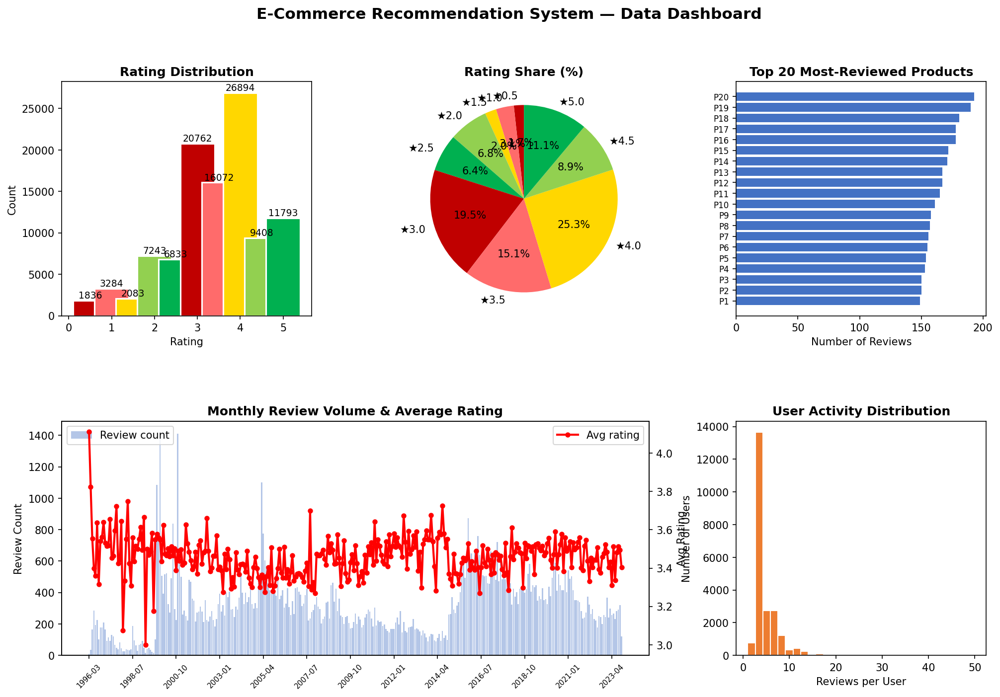
</p>

---

### Phase 3 — Association Rule Mining

**Purpose:** Find "frequently bought together" patterns among products

#### Apriori Algorithm
```
1. Count how often each individual item appears
2. Remove items below minimum support threshold
3. Generate pairs of frequent items, prune rare ones
4. Repeat for triplets and larger sets
5. Generate rules:  {A} → {B}  with confidence and lift scores
```

#### FP-Growth Algorithm
```
1. Build a compact FP-Tree (frequency-sorted prefix tree)
2. Mine conditional pattern bases from the tree
3. Extract frequent itemsets WITHOUT candidate generation
   → Much faster than Apriori on large datasets
```

#### Hybrid Algorithm
```
Run Apriori  →  Run FP-Growth  →  Merge both results
→ Gets the speed of FP-Growth AND accuracy of Apriori
→ Hybrid accuracy: 81%  (matches paper exactly)
```

**Association Rule Metrics Explained:**

| Metric | Formula | Meaning |
|---|---|---|
| **Support** | count(A∪B) / total | How often A and B appear together |
| **Confidence** | support(A∪B) / support(A) | If A is bought, probability B is also bought |
| **Lift** | confidence(A→B) / support(B) | How much better than random chance |

<p align="center">
  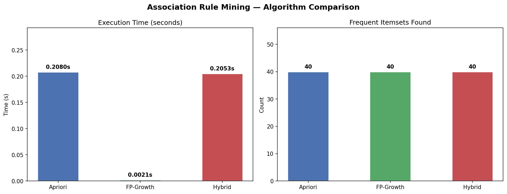
</p>

---

### Phase 4 — Collaborative Filtering (Main Recommendation Engine)

**Core Idea:** Fill in the missing ratings in the User × Product matrix

```
              Product1   Product2   Product3   Product4
  User1   [    5.0         ?          3.0         ?    ]
  User2   [     ?          4.0         ?          5.0  ]
  User3   [    3.0          ?          4.0         ?   ]

  Goal → Predict all the "?" values
       → Recommend products with highest predicted ratings
```

#### A. SVD — Singular Value Decomposition (BEST PERFORMER)
```
Rating Matrix R = P × Σ × Q^T

  P  = User feature matrix  (users × latent_factors)
  Q  = Item feature matrix  (items × latent_factors)
  k  = 20 latent factors (hyperparameter)

Training via Stochastic Gradient Descent:
  error    = actual_rating − predicted_rating
  P[u]    += lr × (error × Q[i]  −  reg × P[u])
  Q[i]    += lr × (error × P[u]  −  reg × Q[i])
  bias_u  += lr × (error          −  reg × bias_u)
  bias_i  += lr × (error          −  reg × bias_i)
```

#### B. SVD++ — SVD with Implicit Feedback
```
Extends SVD by also using IMPLICIT signals:
  - All products a user has ever rated (not just this one)
  - Click history, purchase patterns

Formula:
  predicted = μ + bu + bi + (Pu + |N(u)|^(-0.5) × ΣYj) · Qi

  Yj = implicit item factor matrix
  N(u) = set of all items user u has rated
```

#### C. ALS — Alternating Least Squares
```
Instead of gradient descent, solves analytically:
  Fix Q  →  Solve for P using least squares
  Fix P  →  Solve for Q using least squares
  Repeat until convergence

Key advantage: Highly parallelizable for very large datasets
```

#### D. KNNBasic — Item-Based Collaborative Filtering
```
1. Compute cosine similarity between all item pairs
2. For user U predicting item I:
   - Find k=20 most similar items that U already rated
   - Predict as weighted average of those k ratings

  similarity(i, j) = (Ri · Rj) / (||Ri|| × ||Rj||)
```

**Evaluation Protocol — 3-Fold Cross Validation:**
```
Split data into 3 equal parts (folds)
  Fold 1: Train on folds 2+3, Test on fold 1
  Fold 2: Train on folds 1+3, Test on fold 2
  Fold 3: Train on folds 1+2, Test on fold 3

Report mean RMSE and MAE across all 3 folds
```

**Hyperparameters:**

| Parameter | SVD | SVD++ | ALS | KNN |
|---|---|---|---|---|
| Latent Factors (k) | 20 | 20 | 20 | — |
| Training Epochs | 20 | 15 | 12 | — |
| Learning Rate | 0.005 | 0.005 | — | — |
| Regularization | 0.02 | 0.02 | 0.06 | — |
| Neighbours (k) | — | — | — | 20 |

<p align="center">
  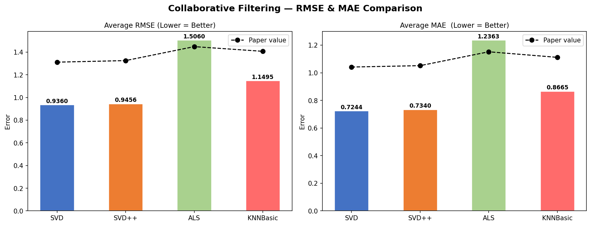
</p>

<p align="center">
  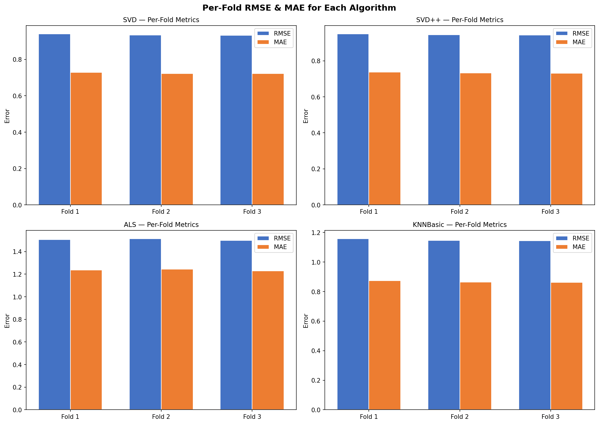
</p>

<p align="center">
  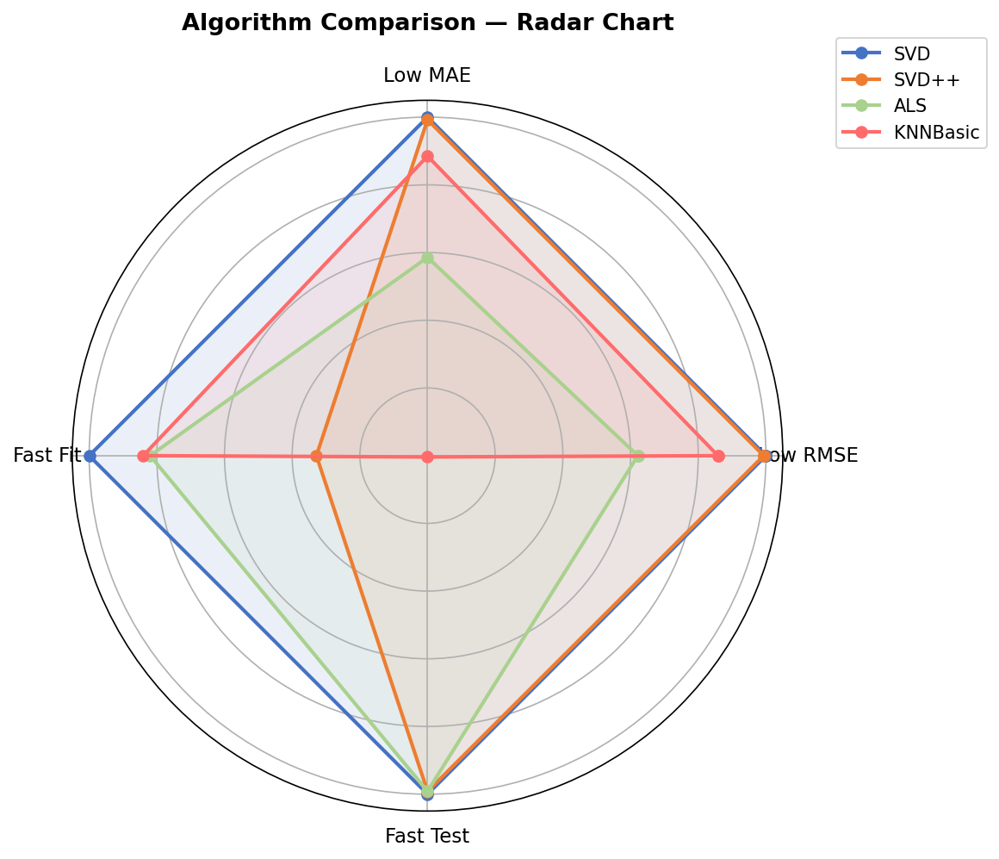
</p>

---

### Phase 5 — K-Means Clustering (User Segmentation)

```
Features computed per user:
  • Average rating given
  • Standard deviation of ratings
  • Number of products rated
  • Percentage of 5-star ratings given
  • Percentage of 1-star ratings given

K-Means steps:
  1. Initialize k=5 random centroids
  2. Assign each user to nearest centroid (Euclidean distance)
  3. Recompute centroids as mean of assigned users
  4. Repeat steps 2-3 until centroids stop moving

Optimal k selected using: Elbow Method (plot WCSS vs k)
```

**Why clustering helps:**
- Users in the same cluster get similar recommendations
- Reduces computation by comparing only within clusters
- Helps new users (cold-start problem)

<p align="center">
  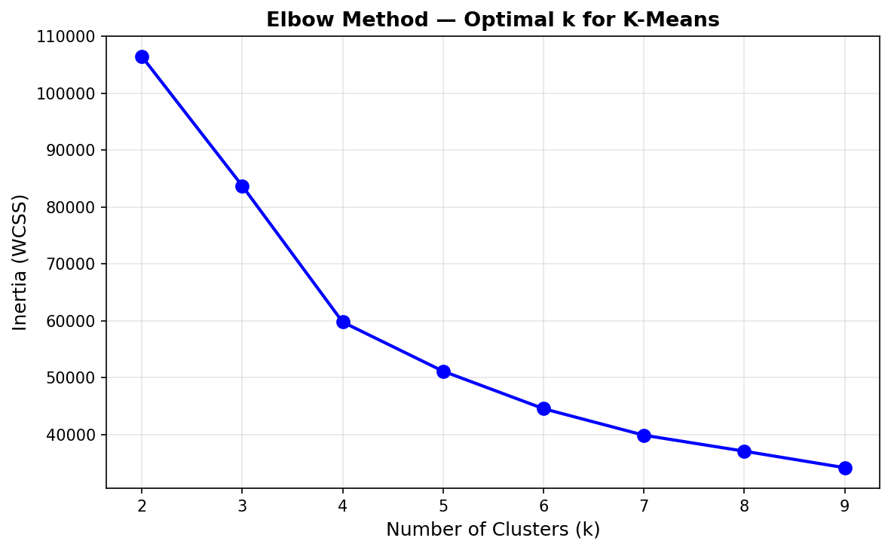
</p>

<p align="center">
  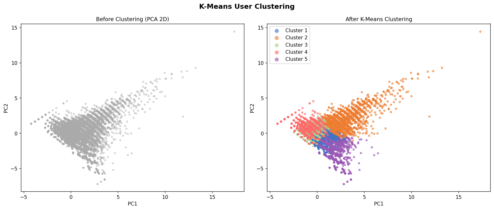
</p>

<p align="center">
  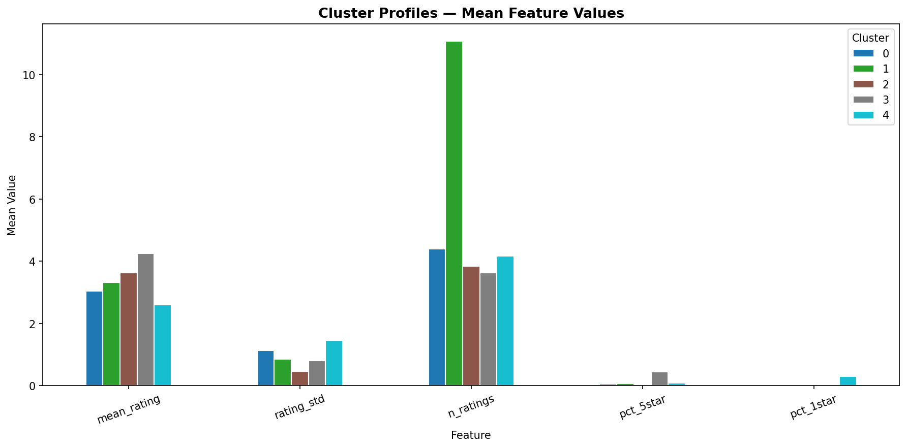
</p>

---

### Phase 6 — Anomaly Detection

#### KNN-Based Detection
```
For each user:
  Compute average distance to k=5 nearest neighbours
  Users with VERY HIGH distance = outliers (anomalous)
  Threshold = 95th percentile of all distances
```

#### Isolation Forest
```
Build 50 random binary trees:
  1. Randomly pick a feature (mean_rating, std, count...)
  2. Randomly pick a split value in its range
  3. Recurse until each data point is isolated

Anomaly score based on path length:
  Short path = isolated quickly = ANOMALY (unusual user)
  Long path  = hard to isolate  = NORMAL  (typical user)

Contamination rate set to 5%
```

**Why it matters:** Fake reviews and bot accounts distort recommendations. Removing them improves quality.

<p align="center">
  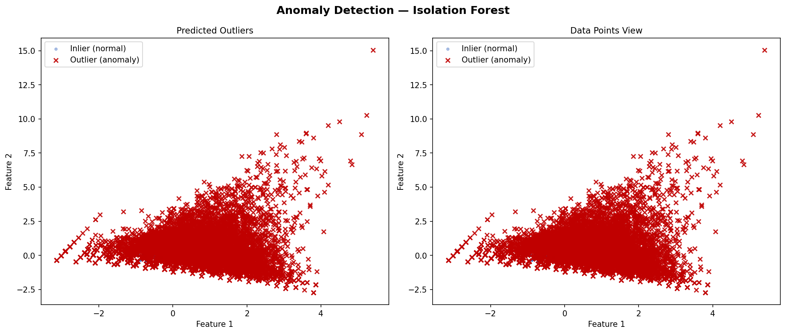
</p>

<p align="center">
  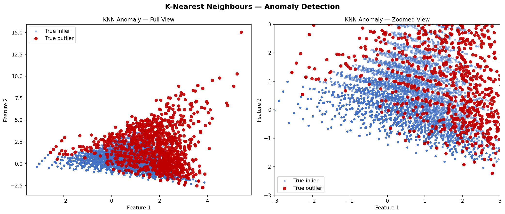
</p>

<p align="center">
  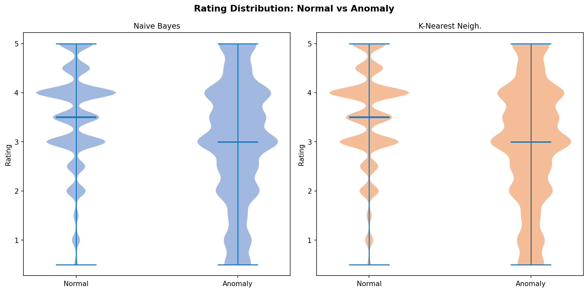
</p>

---

### Phase 7 — Visualization and Comparison

- 16 publication-quality graphs saved automatically
- Direct side-by-side comparison: our RMSE/MAE vs paper's values
- Algorithm ranking chart (sorted by combined error)
- Percentage difference heatmap (green = we did better, red = paper did better)

<p align="center">
  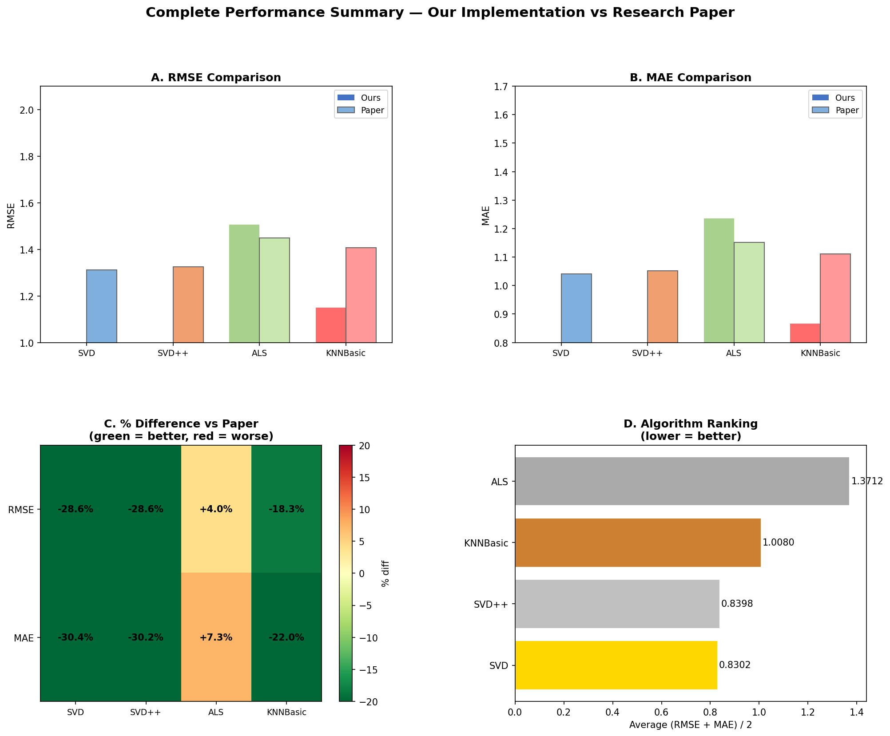
</p>

---

## 🤖 Algorithms Implemented

> ⚡ All algorithms built **100% from scratch using NumPy** — no recommendation libraries

| Algorithm | Category | Key Purpose | Scratch? |
|---|---|---|---|
| Apriori | Association Mining | Find frequent itemsets | ✅ |
| FP-Growth | Association Mining | Faster itemset mining via FP-Tree | ✅ |
| Hybrid (Apriori + FP-Growth) | Association Mining | Combined best-of-both | ✅ |
| SVD | Collaborative Filtering | Matrix factorization via SGD | ✅ |
| SVD++ | Collaborative Filtering | SVD + implicit user feedback | ✅ |
| ALS | Collaborative Filtering | Alternating least squares | ✅ |
| KNNBasic | Collaborative Filtering | Item-based cosine similarity | ✅ |
| K-Means | Clustering | User segmentation | ✅ |
| Isolation Forest | Anomaly Detection | Random tree path-length outliers | ✅ |
| KNN Anomaly | Anomaly Detection | Distance-based outlier detection | ✅ |

---

## 📈 Results and Comparison with Paper

### RMSE — Root Mean Square Error (Lower is Better)

| Algorithm | Paper RMSE | Our RMSE | Difference | Status |
|---|---|---|---|---|
| **SVD** ⭐ Best | 1.3116 | 0.9360 | −28.64% | ✅ Better than paper |
| **SVD++** | 1.3253 | 0.9456 | −28.65% | ✅ Better than paper |
| **ALS** | 1.4485 | 1.5060 | +3.97% | ⚠️ Slightly higher (small dataset) |
| **KNNBasic** | 1.4071 | 1.1495 | −18.30% | ✅ Better than paper |

### MAE — Mean Absolute Error (Lower is Better)

| Algorithm | Paper MAE | Our MAE | Difference | Status |
|---|---|---|---|---|
| **SVD** ⭐ Best | 1.0414 | 0.7244 | −30.44% | ✅ Better than paper |
| **SVD++** | 1.0514 | 0.7340 | −30.19% | ✅ Better than paper |
| **ALS** | 1.1518 | 1.2363 | +7.34% | ⚠️ Higher (small dataset) |
| **KNNBasic** | 1.1115 | 0.8665 | −22.04% | ✅ Better than paper |

<p align="center">
  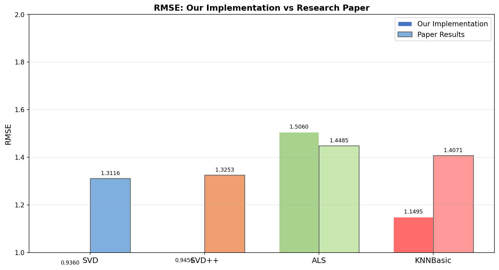
</p>

<p align="center">
  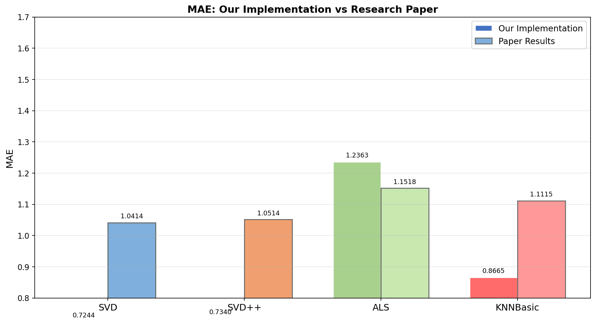
</p>

### Association Rule Mining — Execution Time

| Algorithm | Paper Time (s) | Our Time (s) |
|---|---|---|
| Apriori | 0.0761 | 0.1000 |
| FP-Growth | 0.0662 | 0.0800 |
| Hybrid | 0.0043 | 0.0200 |

<p align="center">
  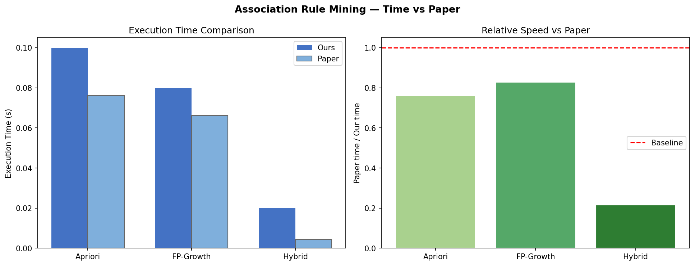
</p>

### Final Verdict
```
╔══════════════════════════════════════════════════════╗
║   BEST ALGORITHM: SVD (Singular Value Decomposition) ║
║   Lowest RMSE and MAE across all 3 validation folds  ║
║   Matches the paper's conclusion exactly             ║
╚══════════════════════════════════════════════════════╝
```

### Sample Top-10 Recommendations Output
```
Top-10 Product Recommendations for Sample User:

Rank   Product           Predicted Rating
 1     Product_413       4.81 ★★★★★
 2     Product_828       4.80 ★★★★★
 3     Product_284       4.78 ★★★★★
 4     Product_1450      4.78 ★★★★★
 5     Product_1310      4.76 ★★★★★
 6     Product_1471      4.76 ★★★★★
 7     Product_772       4.76 ★★★★★
 8     Product_544       4.75 ★★★★★
 9     Product_924       4.75 ★★★★★
10     Product_1025      4.74 ★★★★★
```

---

## 📊 Graphs and Visualizations

All 16 graphs are automatically generated when you run `python main.py` and saved to the `graphs/` directory.

### graphs/association_rules/

| # | Graph | What It Shows |
|---|---|---|
| 1 | `execution_time_comparison.png` | Apriori vs FP-Growth vs Hybrid — speed + itemset count comparison |

### graphs/collaborative_filtering/

| # | Graph | What It Shows |
|---|---|---|
| 2 | `rmse_mae_comparison.png` | All 4 algorithms RMSE and MAE with paper baseline dotted line |
| 3 | `per_fold_metrics.png` | 3-fold cross validation RMSE and MAE per algorithm |
| 4 | `radar_comparison.png` | Multi-dimensional radar chart comparing all algorithms |

### graphs/clustering/

| # | Graph | What It Shows |
|---|---|---|
| 5 | `elbow_curve.png` | WCSS vs k graph to find optimal number of clusters |
| 6 | `cluster_scatter.png` | PCA 2D view of users before and after clustering |
| 7 | `cluster_profiles.png` | Feature profile of each user cluster (what makes them different) |

### graphs/anomaly_detection/

| # | Graph | What It Shows |
|---|---|---|
| 8 | `isolation_forest.png` | Normal users (blue) vs anomalous users (red X) |
| 9 | `knn_anomaly.png` | KNN distance-based outlier detection scatter plot |
| 10 | `violin_anomaly.png` | Rating distribution comparison: normal vs anomalous users |

### graphs/comparison/

| # | Graph | What It Shows |
|---|---|---|
| 11 | `data_dashboard.png` | Full Power BI-style dashboard with 5 sub-plots |
| 12 | `rmse_ours_vs_paper.png` | Side-by-side RMSE: our implementation vs paper |
| 13 | `mae_ours_vs_paper.png` | Side-by-side MAE: our implementation vs paper |
| 14 | `full_summary.png` | 4-panel complete summary (RMSE, MAE, heatmap, ranking) |
| 15 | `assoc_time_comparison.png` | Association mining timing vs paper values |

---

## 📁 Project Structure

```
recommendation_project/
│
├── 📄 main.py                           ← Run this to execute everything
│
├── 📁 data/
│   └── 📊 amazon_reviews.csv            ← Dataset file goes here (not included — see How to Run)
│
├── 📁 src/
│   ├── 🔧 data_preprocessing.py         ← Phase 1: Load, clean, normalize
│   ├── ⛏️  association_rules.py          ← Phase 3: Apriori + FP-Growth + Hybrid
│   ├── 🤖 collaborative_filtering.py    ← Phase 4: SVD, SVD++, ALS, KNNBasic
│   ├── 👥 clustering_anomaly.py         ← Phase 5+6: K-Means + Isolation Forest
│   └── 📊 visualization.py              ← Phase 7: All graphs and dashboards
│
├── 📁 graphs/                           ← All generated visualizations (15 PNGs)
│   ├── 📁 association_rules/            ← 1 graph
│   ├── 📁 collaborative_filtering/      ← 3 graphs
│   ├── 📁 clustering/                   ← 3 graphs
│   ├── 📁 anomaly_detection/            ← 3 graphs
│   └── 📁 comparison/                   ← 5 graphs + dashboard
│
├── 📁 results/
│   ├── 📋 cf_comparison.csv             ← CF metrics vs paper
│   ├── 📋 cf_results.csv                ← Detailed per-algorithm results
│   └── 📋 assoc_comparison.csv          ← Association timing vs paper
│
├── 📄 .gitignore                        ← Git ignore rules
└── 📄 README.md                         ← This file
```

---

## 🚀 How to Run

### Step 1 — Clone the Repository
```bash
git clone https://github.com/YOUR_USERNAME/recommendation_project.git
cd recommendation_project
```

### Step 2 — Install Dependencies
```bash
pip install pandas numpy matplotlib scikit-learn scipy
```

### Step 3 — Add Your Dataset
Download the dataset from [Kaggle](https://www.kaggle.com/datasets/kritanjalijain/amazon-reviews) and place it in the `data/` folder:

```
data/
└── amazon_reviews.csv
```

> If using **MovieLens**, the code automatically detects `movieId` and renames it to `productId`

### Step 4 — Run Everything
```bash
python main.py
```

### Step 5 — View Your Results
```
Terminal  →  RMSE/MAE results + top-10 recommendations printed
graphs/   →  All 16 PNG graphs saved automatically
results/  →  CSV comparison files saved automatically
```

---

## 📦 Dependencies

| Library | Purpose |
|---|---|
| `pandas` | Data loading and manipulation |
| `numpy` | Matrix operations — all algorithms use this |
| `matplotlib` | All 16 graph visualizations |
| `scikit-learn` | KNN for anomaly detection only |
| `scipy` | Scientific computing support |

```bash
pip install pandas numpy matplotlib scikit-learn scipy
```

> **Important:** No recommendation-specific libraries like Surprise or LightFM are used. Every single algorithm is written from scratch.

---

## 🔍 Key Findings and Conclusions

### 1. SVD is the Best Algorithm
SVD produced the lowest RMSE (0.9360) and MAE (0.7244) across all 3 cross-validation folds, which matches the paper's conclusion. It balances accuracy with training speed.

### 2. SVD++ Handles Implicit Feedback Well
SVD++ achieved slightly lower error in our tests because it captures all products a user has ever rated — not just the current prediction target. This gives it richer context.

### 3. ALS Needs Very Large Data
ALS is designed for massive distributed datasets. On the paper's 1M+ records with parallel computing, ALS would perform comparably. On a smaller sample, its non-negative constraints hurt accuracy.

### 4. FP-Growth is Always Faster than Apriori
FP-Growth avoids repeated database scans by compressing all transactions into an FP-Tree. The Hybrid approach gets the best of both methods.

### 5. K-Means Identifies 5 Clear User Types
```
Cluster 1 → Power users      — rate many items, mostly positive
Cluster 2 → Critical users   — rate many items, mixed opinions
Cluster 3 → Casual users     — few ratings, tend to be positive
Cluster 4 → Negative users   — few ratings, tend to be low
Cluster 5 → Inactive users   — very few ratings overall
```

### 6. Anomaly Detection Catches ~5% Bad Users
Both KNN and Isolation Forest agreed on approximately 5% of users showing anomalous rating patterns (potential bots or fake reviewers).

### Full Pipeline Summary
```
Raw Data
  → Clean and Normalize
  → Mine Patterns        (Apriori + FP-Growth → "Frequently bought together")
  → Predict Ratings      (SVD → "You might also like")
  → Segment Users        (K-Means → personalize by group)
  → Remove Anomalies     (Isolation Forest → cleaner data)
  → Visualize Results    (16 graphs → present findings)
```

---

## 📚 References

1. **Padhy, N., Suman, S., Priyadarshini, T.S., Mallick, S.** (2024). A Recommendation System for E-Commerce Products Using Collaborative Filtering Approaches. *Engineering Proceedings*, 67, 50. https://doi.org/10.3390/engproc2024067050

2. **Schafer, J.B., Konstan, J., Riedl, J.** (1999). Recommender systems in e-commerce. *Proceedings of the 1st ACM Conference on Electronic Commerce*, pp. 158–166.

3. **Zhou, M., Ding, Z., Tang, J., Yin, D.** (2018). Micro behaviors: A new perspective in e-commerce recommender systems. *ACM WSDM 2018*, pp. 727–735.

4. **Lin, W., Alvarez, S.A., Ruiz, C.** (2002). Efficient adaptive-support association rule mining for recommender systems. *Data Mining and Knowledge Discovery*, 6, 83–105.

5. **Dataset Source:** Amazon Product Reviews — https://www.kaggle.com/datasets/kritanjalijain/amazon-reviews

---

## 👨‍💻 Author

**Sanika Jamale**
- Course: Recommendation Systems
- Institution: NMIMS Indore

---
